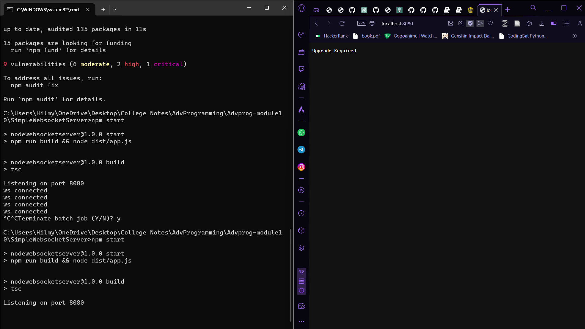
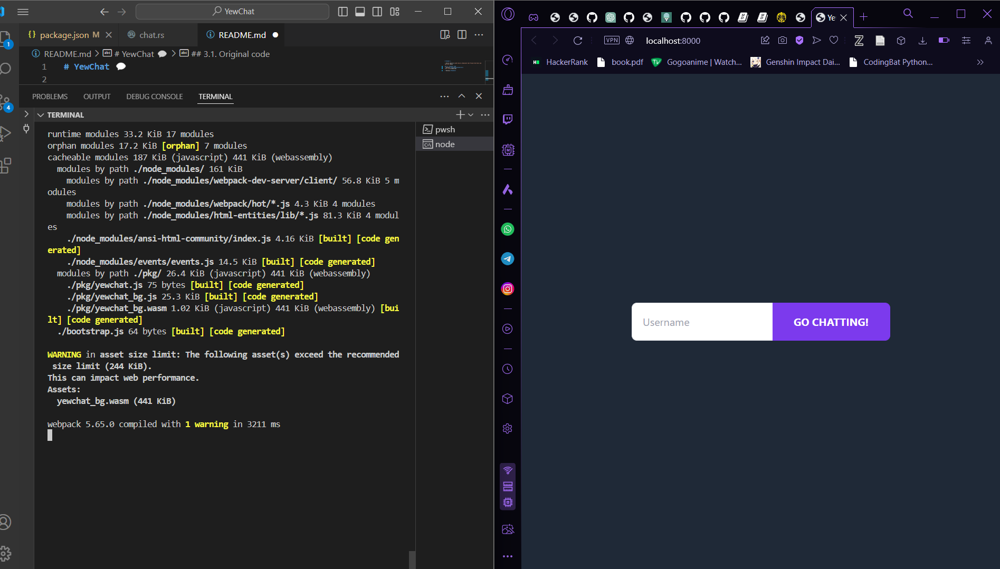
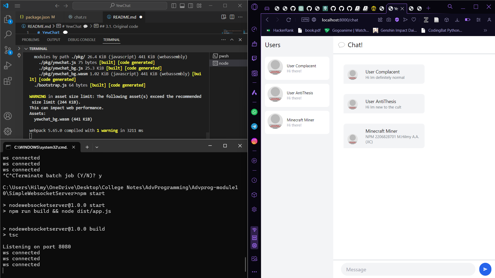

# YewChat 💬

> Source code for [Let’s Build a Websocket Chat Project With Rust and Yew 0.19 🦀](#)

## 3.1. Original code
+ Running **SimpleWebsocketServer**

+ Running **YewChat** 

+ Interacting with **YewChat**
